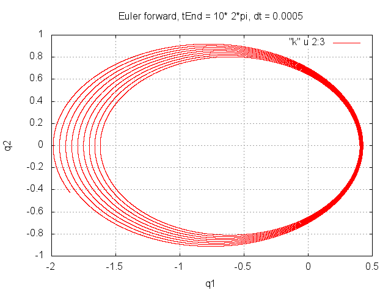

# Homework 8
#### due until 13.01.16

Consider two bodies which attract each other gravitationally. We choose one of the bodies as origin of our coordinate system. Since the motion will take place in one plane, we can describe the position of the second body by a two-dimensional vector *q=(q_1, q_2)*.

The Hamiltonian of the motion is

From the analytic solution to the problem, we know that the motion takes place along an ellipse if *H*<0. Let *e* be the eccentricity of the ellipse.

Let us consider the initial conditions

This implies H = -1/2. The period of the solution is 2. The figure below shows the numerical solution for *tEnd* = 20, obtained after about 125 000 Euler forward steps at *dt* =0.0005. Obviously the solution is not satisfying.

The symplectic Euler method is a much better algorithm for this problem. It is first order in time like Euler forward and belongs to the group of partitioned methods. We may write it as

Write a program which integrates the Hamiltonian two-body problem using the symplectic Euler method. Use the initial conditions mentioned above and generate the same graph as for the forward Euler method above. In a second plot check the conservation of *H*. Choose *dt* = 0.0005 and *dt* = 0.05.

In the end, submit your code and four diagrams (as .png images). Show the orbit and *H* for each of the two *dt*.
